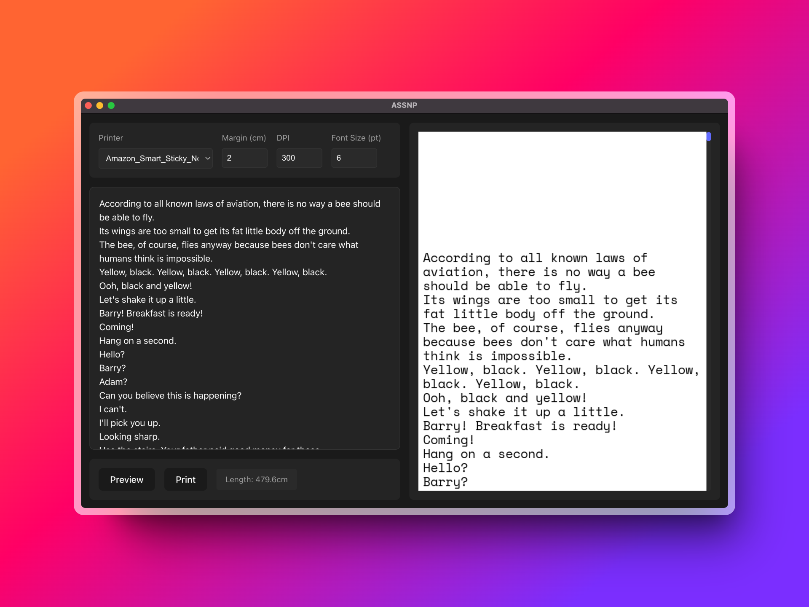

# ASSNP



Print arbitrary text to your Amazon Smart Sticky Note Printer over ipp.

## Setup

1. Install dependencies:
```bash
bun run init
```

This creates a Python virtual environment and installs all required packages.

## Development

Run the development server:
```bash
bun run dev
```

This starts both the React frontend and Python backend. The app will be available at `http://localhost:5173`.

## Building

Create a standalone executable:
```bash
bun run build
```

The build process packages both the frontend and backend into a single executable using PyInstaller.

### Platform-specific Builds

Each platform has its own spec file:
- `build-linux.spec`
- `build-macos.spec`

Note: Build on the target platform - macOS builds must be done on macOS, etc.